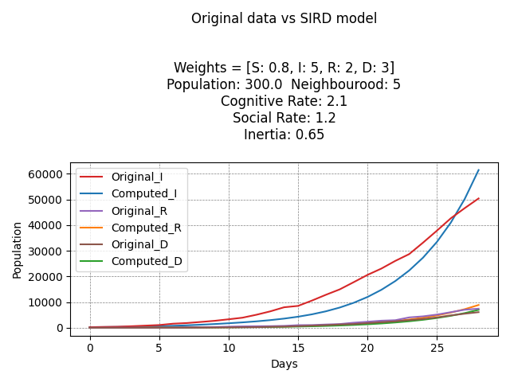
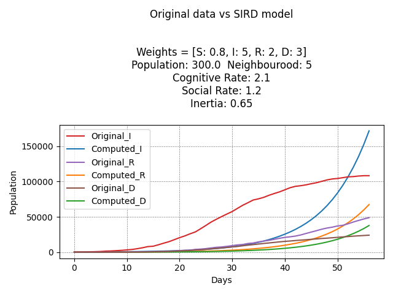
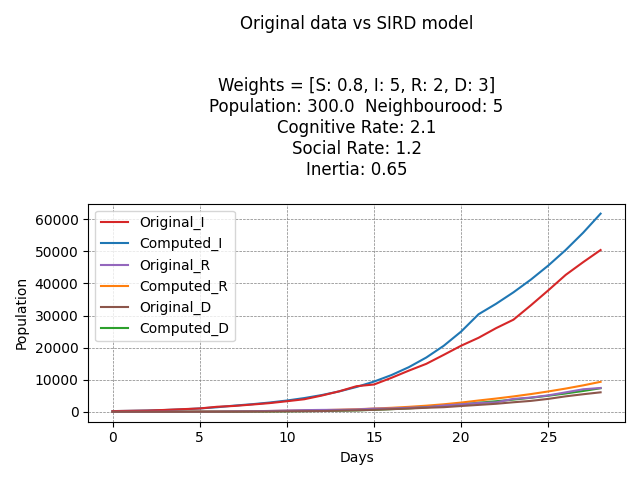
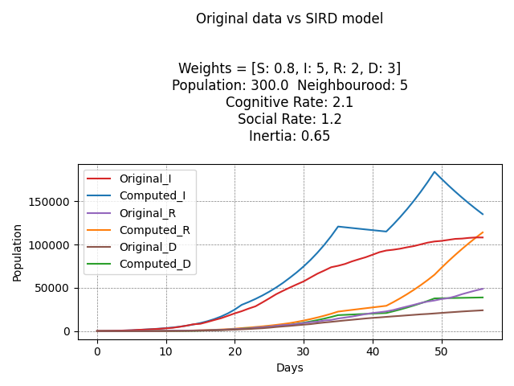
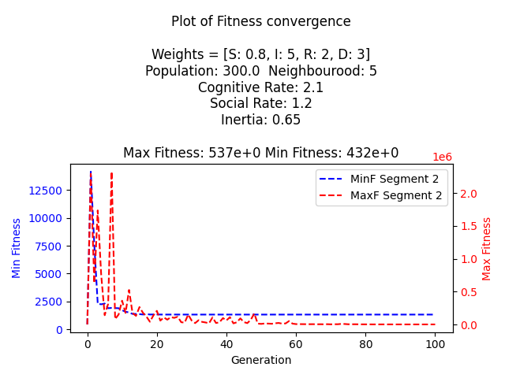

# Epidemic Modelling with Particle Swarm Optimization

This repository contains the implementation of a study that employs the Particle Swarm Optimization (PSO) algorithm to predict the parameters of a SIRD (Susceptible, Infected, Recovered, Deceased) model simulating the spread of the COVID-19 virus. The study utilizes Italian national data from February 24th, 2020, to April 20th, 2020 (8 weeks).

## Overview

Three methods are proposed in this study:

1. Baseline Method: Computes a single set of parameters for the entire simulation period.
2. Time-Varying Approach: Updates parameters weekly to enhance predictive accuracy.
3. Extended Time-Varying Approach: Utilizes a Long Short-Term Memory (LSTM) network to refine the predicted parameters.

## Key Findings

- The time-varying approach demonstrates superior predictive accuracy compared to the baseline, due to its ability to correct errors over time.
- The baseline approach performs adequately in the short term (28 days) but struggles to capture long-term trends (58 days).
- The LSTM-extended approach did not yield coherent or useful predictions to enhance the time-varying approach.

## How to Run the Code

1. Make sure to have ``git-lfs`` installed on your machine.
2. After cloning the repository, navigate to the project directory and execute ```git lfs pull``` to download the large files.
3. Install Poetry by running ```curl -sSL https://install.python-poetry.org | python3 -```.
4. Install the project dependencies by running ```poetry install```.
5. Activate the virtual environment by running ```poetry shell```.
6. Run the PSO optimization by executing ```python3 epidemic_modelling/pso.py```.
    - By not speficying any arguments, the script will run the baseline method.
    - To run the time-varying approach, add the ```--time-varying``` flag.
    - To run the LSTM-extended approach, add the ```--lstm``` flag.
7. By running ```sird_playground.ipynb```, you can visualize the results of the optimization.

## Plots

<div style="text-align: center;">
  
  <p><em>Fig. 1: Baseline simulation over 28 days</em></p>
</div>

<div style="text-align: center;">
  
  <p><em>Fig. 2: Baseline simulation over 56 days</em></p>
</div>

<div style="text-align: center;">
  
  <p><em>Fig. 3: Time varying simulation over 28 days</em></p>
</div>

<div style="text-align: center;">
  
  <p><em>Fig. 4: Time varying simulation over 56 days</em></p>
</div>

<div style="text-align: center;">
  
  <p><em>Fig. 5: Fitness values for 2nd week</em></p>
</div>